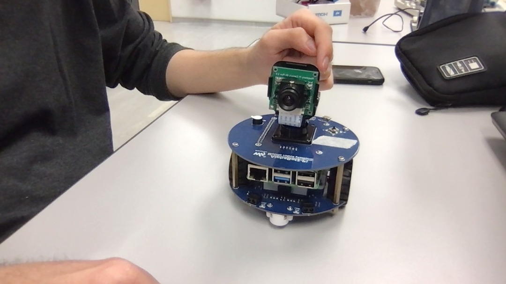
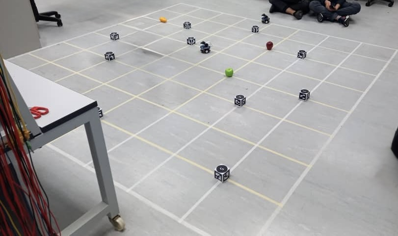
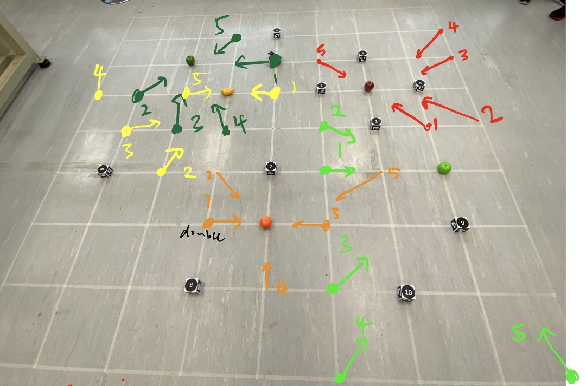

# Autonomous Robot Navigation using EKF-SLAM and A* Search Algorithm - Fruit Search

## Overview

  

This repository contains code for a course on intelligent robotics in Monash University Malaysia. The project is broken down into milestones, with each milestone progressing to the final code used in the final project demonstration. The goal of the project is to develop the code for an autonomous robot used to navigate to specific targets (fruits) in a specified order while avoiding obstacles in an arena. At the same time, the robot uses SLAM and landmarks to generate a map of the arena, which will be compared with the actual map for evaluation. 

The robot is equipped with a Raspberry Pi acting as a client and a computer acting as a server. The robot contains a fixed camera used for ArUco marker and fruit detection. The images captured by the camera are transmitted to the computer where the SLAM algorithm and object detection algorithm is performed. EKF is used to create a virtual model of the robot, maintaining a state vector with prediction of subsequent states using control inputs such as velocity and steering angles. A visual representation of the robot and landmarks is shown using the Pygame library.

### Arena Setup 

  

The arena is organized using grids with ArUco markers and fruits scattered throughout. The robot will have to navigate the arena without bumping into the markers to prevent penalization of marks. 

### Navigation

  

The robot uses EKF-SLAM for navigation within the arena. For the demonstration, the robot will first roam around the arena capturing images of the landmarks and fruits, to generate a virtual map using EKF. For our demonstrations, we pre-plan positions for the robot to capture images of the fruit, following a specific order for each position, after generating a virtual map using the landmarks. With the generated virtual map, the robot captures images of the fruits from various positions to obtain an accurate map of the fruit locations. The final task is for the robot to search for a given list of fruits in a specific order, starting from the center of the arena. 

### Object Detection
YOLOv3 is used for fruit detection. For the training process, we captured images of the fruits and used MATLAB to superimpose cropped images of the fruits on various images of the arena to use as the background. The resulting images were annotated in Roboflow and the model was trained locally. 
